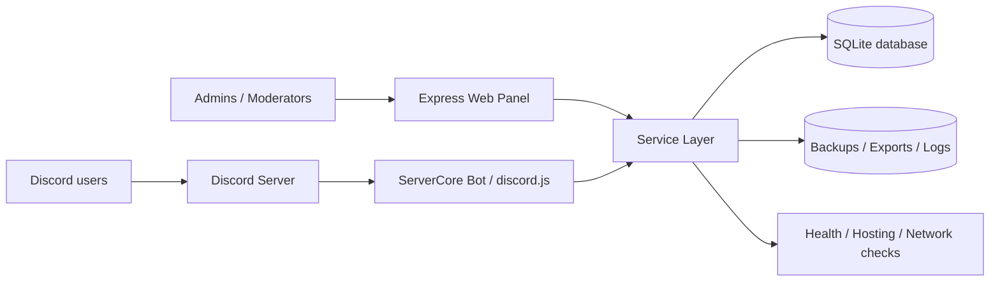

# ServerCore — Discord Management Platform

**ServerCore** — это комплексная платформа для управления Discord-сообществом: Discord-бот, пользовательская веб-панель, административная панель, система ролей, тикеты, экономика, магазин, достижения, onboarding, forum-темы, модерация, бэкапы, диагностика хостинга и production-проверки.

Проект сделан как практическая full-stack система вокруг реального Discord-сервера: пользователь взаимодействует с сервером через slash-команды, кнопки, select-menu, forum-формы и личный кабинет, а администрация управляет сервером через web-панель и служебные команды.

## Кратко

| Раздел | Описание |
|---|---|
| Стек | Node.js 20, discord.js v14, Express, SQLite / JSON fallback, Docker |
| Интерфейсы | Discord slash-команды, кнопки, select-menu, forum-темы, web-панель |
| База данных | SQLite через `better-sqlite3` / `node:sqlite`, fallback на JSON |
| Запуск | `npm install`, `npm run deploy`, `npm run db:migrate`, `npm start` |
| Docker | `Dockerfile`, `docker-compose.yml`, volume для `data` и `logs` |
| CI/CD | GitHub Actions: syntax check, env validation, Docker build |
| Назначение | Автоматизация Discord-сервера и демонстрация production-подхода к pet-проекту |

## Что умеет проект

- Управлять Discord-сервером через команды, кнопки и панели.
- Давать пользователям единый **Мой центр** с профилем, балансом, Daily, тикетами, темами и web-панелью.
- Обрабатывать тикеты, заявки, жалобы, предложения, LFG и forum-темы.
- Вести XP, уровни, репутацию, достижения, бейджи, экономику, магазин, инвентарь и Battle Pass.
- Автоматизировать onboarding новых участников.
- Давать модераторам инструменты warn, mute, clear, cases, history и context-menu действия.
- Давать администраторам web-панель, audit, backup/export, production-check, health-check и диагностику хостинга.
- Работать локально, на VPS, в Docker и на BotHost/Bothost-подобном хостинге.

## Архитектура

Основная схема находится в [`docs/ARCHITECTURE.md`](docs/ARCHITECTURE.md).



## Быстрый старт

### 1. Установить зависимости

```bash
npm install
```

### 2. Подготовить `.env`

```bash
cp .env.example .env
```

Минимально заполнить:

```env
DISCORD_TOKEN=
CLIENT_ID=
GUILD_ID=
WEB_PASSWORD=
WEB_SESSION_TOKEN=
DB_DRIVER=sqlite
SQLITE_PATH=./data/database.sqlite
WEB_PANEL_ENABLED=true
WEB_PORT=3000
```

`.env` нельзя публиковать в GitHub, потому что там находятся токены и пароли.

### 3. Зарегистрировать Discord-команды

```bash
npm run deploy
```

### 4. Выполнить миграцию базы

```bash
npm run db:migrate
```

### 5. Запустить проект

```bash
npm start
```

Web-панель локально:

```text
http://localhost:3000
```

## Docker-запуск

```bash
docker compose up -d --build
```

Контейнер использует:

- порт `3000`;
- volume `./data:/app/data` для базы данных;
- volume `./logs:/app/logs` для логов;
- `.env` как источник переменных окружения.

Подробнее: [`docs/DEPLOYMENT_DOCKER_CI.md`](docs/DEPLOYMENT_DOCKER_CI.md).

## База данных и миграции

Проект поддерживает SQLite и fallback на JSON.

```bash
npm run db:migrate
npm run db:backup
```

Ключевые настройки:

```env
DB_DRIVER=sqlite
SQLITE_PATH=./data/database.sqlite
```

Подробнее: [`docs/DATABASE_AND_MIGRATIONS.md`](docs/DATABASE_AND_MIGRATIONS.md).

## Роли доступа

В проекте есть централизованная модель доступа:

| Уровень | Назначение |
|---|---|
| Member | базовые пользовательские функции |
| VIP | расширенные пользовательские возможности |
| Helper | помощь с тикетами, заявками и историей |
| Moderator | модерация, предупреждения, mute, clear, cases |
| Admin | настройки, панели, AutoMod, backups, events, tournaments |
| Owner | maintenance, restore, критичные системные действия |

Подробнее: [`docs/ROLES_ACCESS.md`](docs/ROLES_ACCESS.md).

## Основные модули

Полный список модулей описан в [`docs/MODULES.md`](docs/MODULES.md). Основные блоки:

- User Center / UX Flow;
- профили, XP, уровни, достижения и бейджи;
- экономика, daily, магазин, инвентарь;
- тикеты, заявки, жалобы, предложения;
- forum-темы и пользовательские списки;
- onboarding;
- роли и access-control;
- модерация и AutoMod;
- события, турниры, LFG, временные voice-комнаты;
- web-панель администратора и пользователя;
- backup/export, audit, health, hosting/network diagnostics;
- музыкальный модуль с диагностикой Discord Voice / YouTube.

## Скриншоты

Файл [`docs/SCREENSHOTS.md`](docs/SCREENSHOTS.md) содержит чеклист скриншотов для портфолио и имена файлов, которые лучше положить в `docs/assets/screenshots/`.

Рекомендуемый набор:

- `/me` — Smart User Center;
- `/roles` — выбор ролей через select-menu;
- `/ticket` или web-форма тикета;
- пользовательская web-панель;
- admin dashboard;
- health/hosting diagnostics;
- `/commands` или справочник команд;
- shop/deals;
- forum thread creation.

## Проверки качества

```bash
npm run check
npm run env:check
npm run hosting:check
npm run net:check
npm run doctor
npm run production:check
```

## CI/CD

В репозитории добавлен workflow:

```text
.github/workflows/ci.yml
```

Он проверяет синтаксис, env-конфигурацию и сборку Docker-образа. Подробнее: [`docs/DEPLOYMENT_DOCKER_CI.md`](docs/DEPLOYMENT_DOCKER_CI.md).

## Какие проблемы решались

Проект показывает не только набор функций, но и инженерную работу:

- перевод хранения данных с JSON на SQLite с fallback;
- безопасная работа с `.env`, токенами и production-настройками;
- стабилизация Discord interactions: deferred replies, expired interactions, safe edit/update;
- адаптация под Node.js 20 и хостинг с ограничениями;
- Docker-сборка с системными зависимостями для Discord Voice;
- диагностика UDP, ffmpeg, opus, libsodium и YouTube audio restrictions;
- проектирование UX, где пользователь действует через кнопки и web-панель, а не запоминает команды.

Подробнее: [`docs/PROBLEMS_SOLVED.md`](docs/PROBLEMS_SOLVED.md).

## Roadmap

План развития находится в [`docs/ROADMAP.md`](docs/ROADMAP.md). Ближайшие направления:

- улучшение визуального портфолио и скриншотов;
- расширение пользовательской web-панели;
- Lavalink/альтернативный music backend;
- тесты сервисного слоя;
- полноценная миграционная система для SQLite;
- улучшенная observability: structured logs, metrics, uptime checks.

## Структура проекта

```text
src/commands/      Slash-команды и context-menu действия
src/services/      Бизнес-логика модулей
src/web/           Express web-панель
src/config/        Конфигурация сервера, каналов и ролей
src/tools/         CLI-проверки, миграции, диагностика, backup
docs/              Документация проекта
data/              База данных и runtime-данные, не коммитить реальные данные
logs/              Runtime-логи, не коммитить реальные логи
```

## Для работодателя

ServerCore можно презентовать как pet-проект уровня “маленький продукт”, потому что он включает:

- backend на Node.js;
- интеграцию с внешней платформой Discord;
- web-интерфейс;
- хранение данных и миграцию;
- Docker и CI/CD;
- role-based access control;
- диагностику production-проблем;
- пользовательский UX-flow;
- техническую документацию.

Короткое портфолио-описание: [`docs/PORTFOLIO.md`](docs/PORTFOLIO.md).
