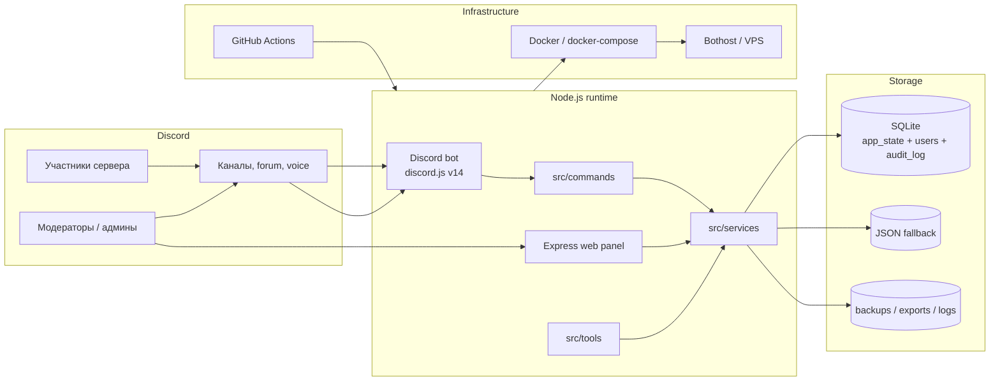
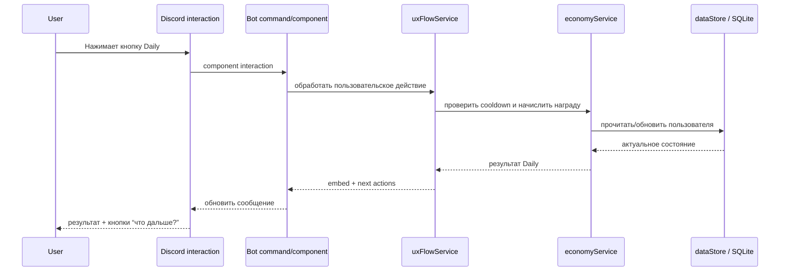

# Архитектура ServerCore

ServerCore построен как модульная Node.js-платформа: Discord-бот и Express web-панель используют общий service layer и единое хранилище данных.

## Общая схема



## Основные слои

### 1. Discord Interface

Слой команд и интерактивных компонентов:

- slash-команды в `src/commands/`;
- кнопки, select-menu и modal forms;
- context-menu действия для модерации и профилей;
- forum-thread flow для заявок, вопросов и пользовательских тем;
- voice-flow для временных комнат и музыкального модуля.

### 2. Web Interface

Express web-панель в `src/web/server.js`:

- admin dashboard;
- user panel;
- health/hosting/network pages;
- users, profiles, economy, shop, tickets, applications;
- commands/docs/project pages;
- backups, audit, maintenance.

### 3. Service Layer

`src/services/` содержит бизнес-логику. Команды и web routes не должны напрямую реализовывать сложные сценарии — они вызывают сервисы.

Примеры сервисов:

- `userMenuService`, `uxFlowService` — пользовательский путь и “Мой центр”;
- `ticketService`, `applicationService`, `threadForumService` — обращения, заявки и forum-темы;
- `economyService`, `inventoryService`, `shopPanel` — монеты, покупки, инвентарь;
- `accessControlService` — централизованная проверка доступа;
- `dataStore` — слой хранения данных;
- `backupService`, `healthCheckService`, `hostingCheckService`, `networkCheckService` — эксплуатация и диагностика.

### 4. Storage Layer

Основное хранилище — SQLite. Для совместимости с ограниченными хостингами оставлен JSON fallback.

SQLite используется через:

- `node:sqlite`, если доступен;
- `better-sqlite3`, если `node:sqlite` недоступен;
- JSON fallback, если SQLite не поднялся.

### 5. Infrastructure Layer

Инфраструктурный слой:

- `Dockerfile` на `node:20-bookworm-slim`;
- `docker-compose.yml` с volume для `data` и `logs`;
- `.env.example` / `.env.production.example`;
- GitHub Actions workflow для CI;
- scripts в `package.json` для deploy, migration, backup и diagnostics.

## Поток пользовательского действия

Пример: пользователь нажимает Daily в “Мой центр”.



## Почему такая архитектура подходит для портфолио

Проект демонстрирует несколько инженерных направлений одновременно:

- event-driven integration с Discord;
- backend API/web-panel на Express;
- хранение данных и миграции;
- доступы и модераторские роли;
- контейнеризация;
- production diagnostics;
- UX-проектирование пользовательского пути.

## Файл схемы

Для GitHub README можно использовать Mermaid-блок выше. Отдельный SVG-файл лежит здесь:

```text
docs/assets/architecture.svg
```
